# DevJobs

Plataforma de reclutamiento IT construida con **Laravel 11**, **Livewire 3** y **Tailwind CSS**.

<h2 align="center">Vistas Reclutador</h2>

<table align="center">
  <tr>
      <td>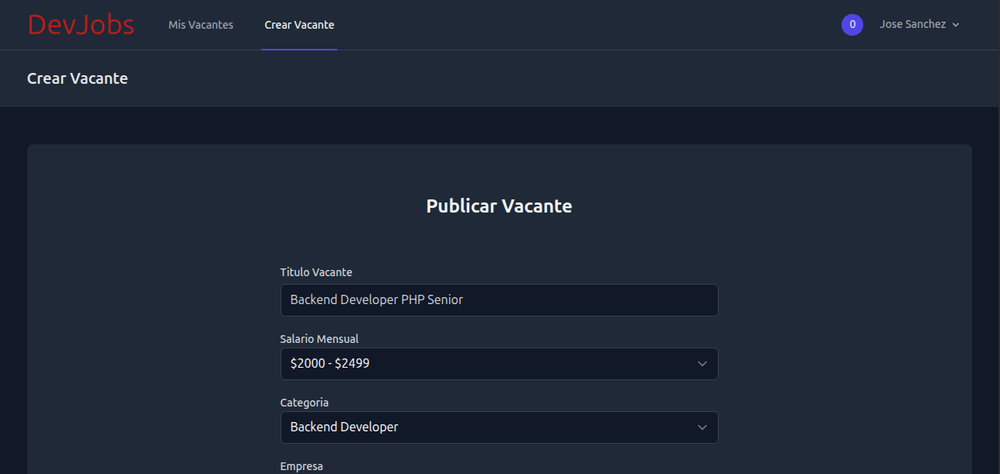</td>
      <td>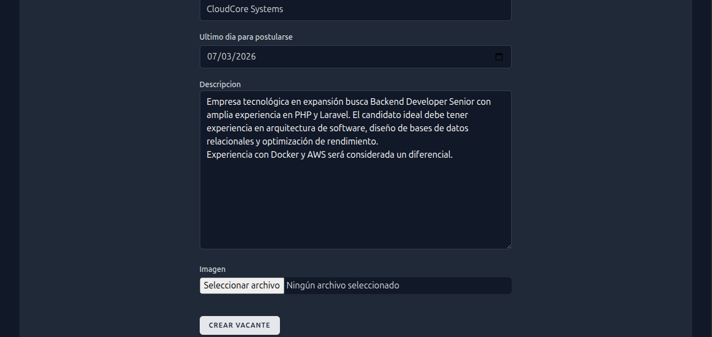</td>
      <td>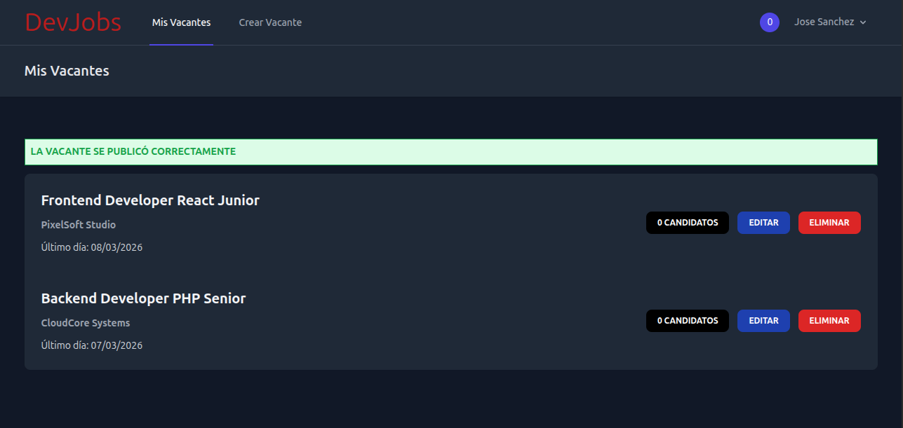</td>
      <td>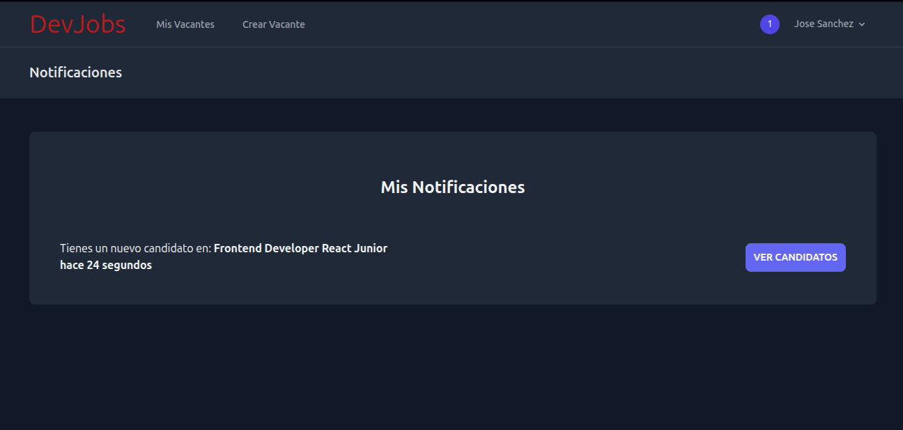</td>
      <td>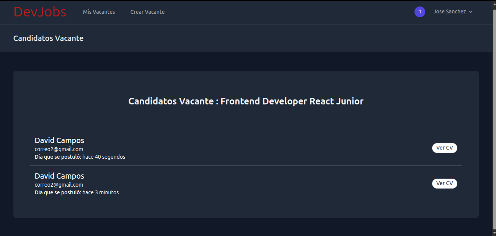</td>
      <td>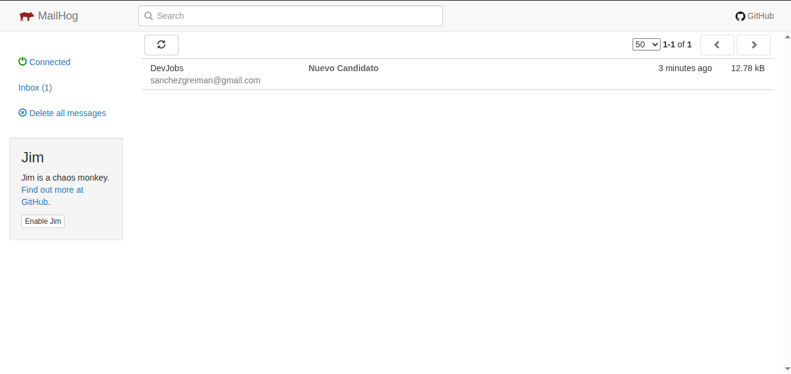</td>
      <td>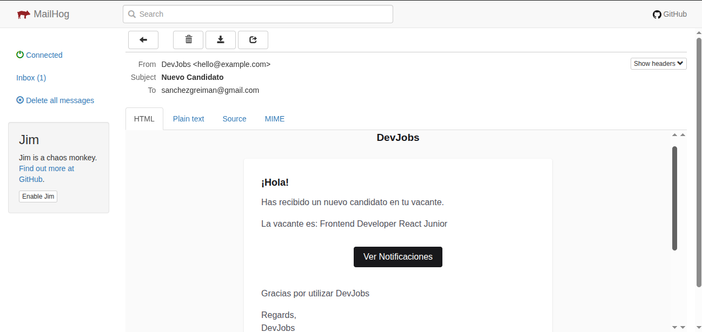</td>
  </tr>
</table>

<h2 align="center">Vistas Candidato</h2>

<table align="center">
   <tr>
      <td>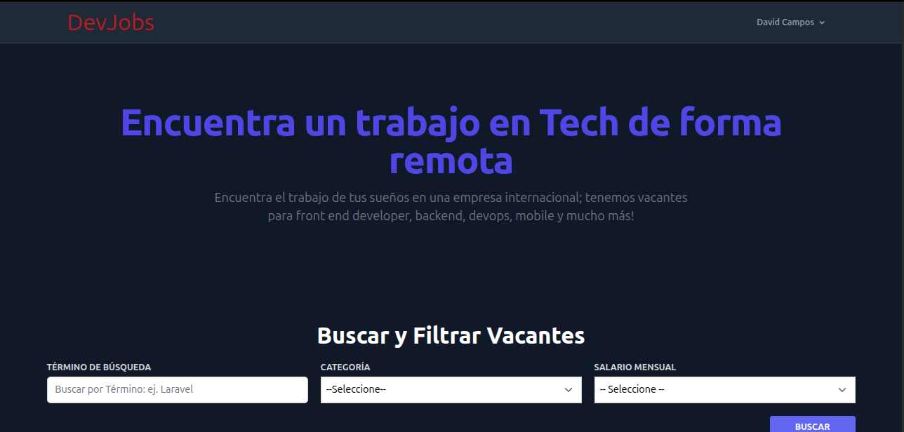</td>
      <td>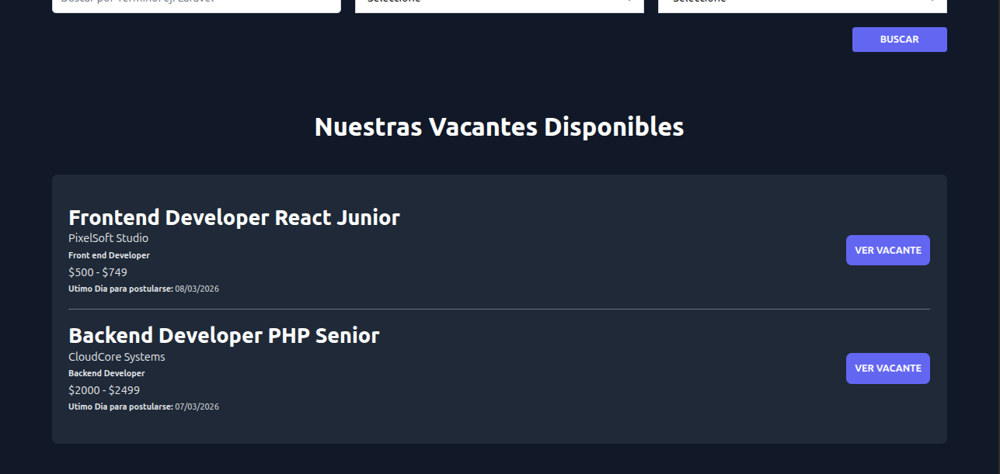</td>
      <td>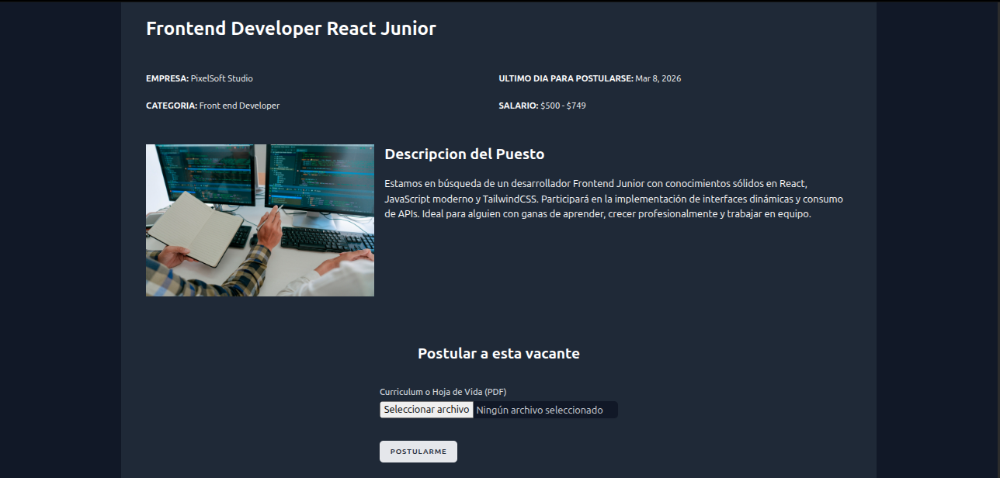</td>
   </tr>
</table>

<h2 align="center">Edicion de Perfil</h2>

<table align="center">
   <tr>
      <td>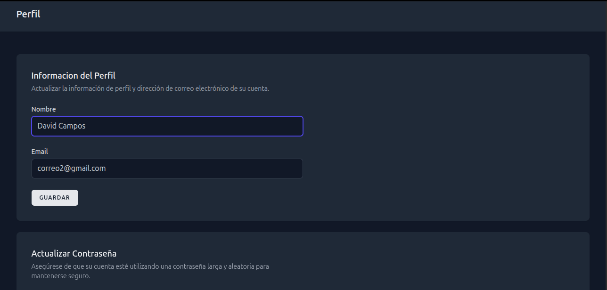</td>
      <td>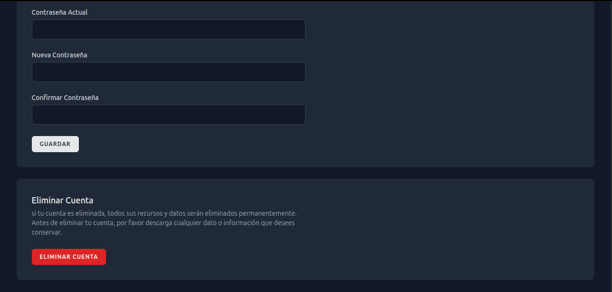</td>
   </tr>
</table>

## Funcionalidades principales

- Registro y autenticación con Laravel Breeze
- Roles: Reclutador / Candidato
- Publicación y gestión de vacantes
- Postulación con carga de CV en PDF
- Notificaciones por correo y base de datos
- Protección de rutas mediante middleware
- Componentes dinámicos con Livewire 3

## Requisitos

- PHP 8.2+
- Composer
- Node.js y npm
- MySQL
- MailHog

## Instalación

### Configuración inicial (primera vez)

```bash
composer setup
```

Este comando ejecuta automáticamente:
1. `composer install` - Instala dependencias de PHP
2. Copia `.env.example` a `.env` si no existe
3. `php artisan key:generate` - Genera la clave de la aplicación
4. `php artisan migrate --force` - Ejecuta las migraciones
5. `php artisan storage:link` - Crea el symlink para archivos públicos (CVs e imágenes)
6. `npm install` - Instala dependencias de Node.js
7. `npm run build` - Compila los assets

**¿Cuándo ejecutar `composer setup`?**
- Al clonar el repositorio por primera vez
- Después de un `git pull` que incluya nuevas migraciones
- Si eliminaste el symlink de storage o el archivo `.env`

### Desarrollo

```bash
composer dev
```

Inicia simultáneamente:
- Servidor Laravel (`php artisan serve`)
- Compilación en tiempo real con Vite (Hot Reload)

### Envío de Correos (Mailhog)

Este proyecto utiliza **Mailhog** para capturar los correos electrónicos en el entorno de desarrollo. 

1. **Asegúrate de tener Mailhog instalado y corriendo.**
   - Si usas Docker: `docker run -d -p 1025:1025 -p 8025:8025 mailhog/mailhog`
   - Si lo instalaste vía Brew/Directo: solo `mailhog` en la terminal, dentro del proyecto
2. **Configuración en `.env`:**
   ```env
   MAIL_MAILER=smtp
   MAIL_HOST=127.0.0.1
   MAIL_PORT=1025
3. **Ver correos:**
   - Accede a http://localhost:8025 para ver la bandeja de entrada de prueba.

## Estructura de Almacenamiento

Los archivos subidos (CVs, imágenes de vacantes) se guardan en `storage/app/public/` con la siguiente estructura:

```
storage/app/public/
├── vacantes/{vacante_id}/      # Imágenes asociadas a vacantes
│   └── {imagen}.jpg
└── cvs/{candidato_id}/        # CVs PDF de candidatos
	└── {cv}.pdf
```

Se acceden vía `/storage/...` gracias al symlink creado por `php artisan storage:link`.

## 🛡️ Seguridad y Autorización

- **Policies de Laravel:** Implementación de políticas de acceso para asegurar que solo el creador de una vacante pueda gestionar a sus candidatos.
- **Middlewares Personalizados:** Restricción de acceso a funciones de reclutador mediante el middleware `RolUsuario`.
- **Validación de Archivos:** Reglas estrictas para la subida de CVs, limitando extensiones (PDF) y tamaños de archivo.